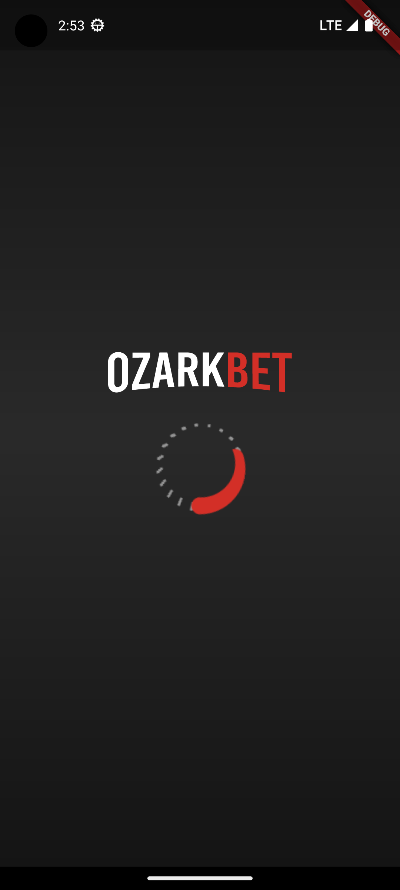
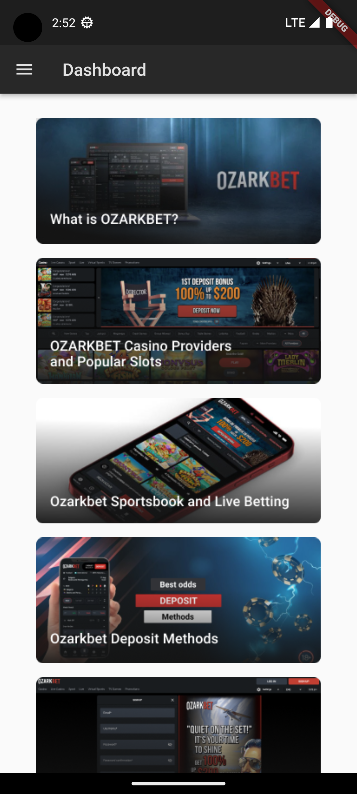
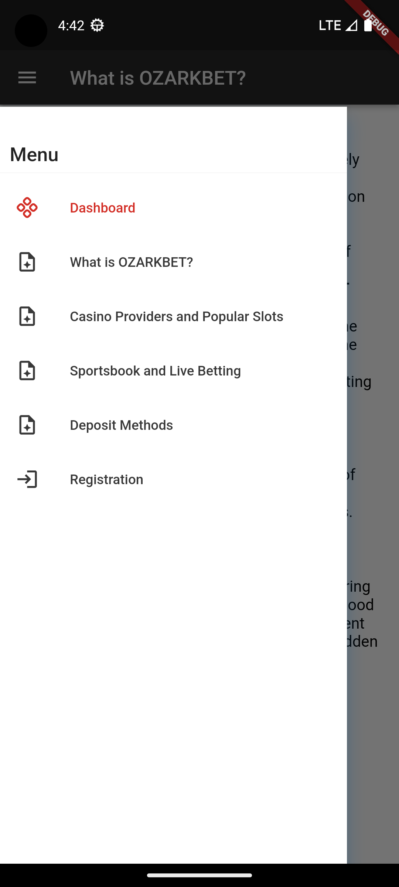

Приложение использует 2а состояния которые определяются результатом редиректа зашитой в него арбитражной ссылкой, проверкой установленных приложений и состоянием заряда батареи\
1 состояние - проверка прошла успешно открывается окно с рекламной\
2 соостояния - проверка не прошла открывается основное информационное приложение 

  
  &nbsp&nbsp&nbsp&nbsp&nbsp&nbsp&nbsp
  
   &nbsp&nbsp&nbsp&nbsp&nbsp&nbsp&nbsp
  
   &nbsp&nbsp&nbsp&nbsp&nbsp&nbsp&nbsp

